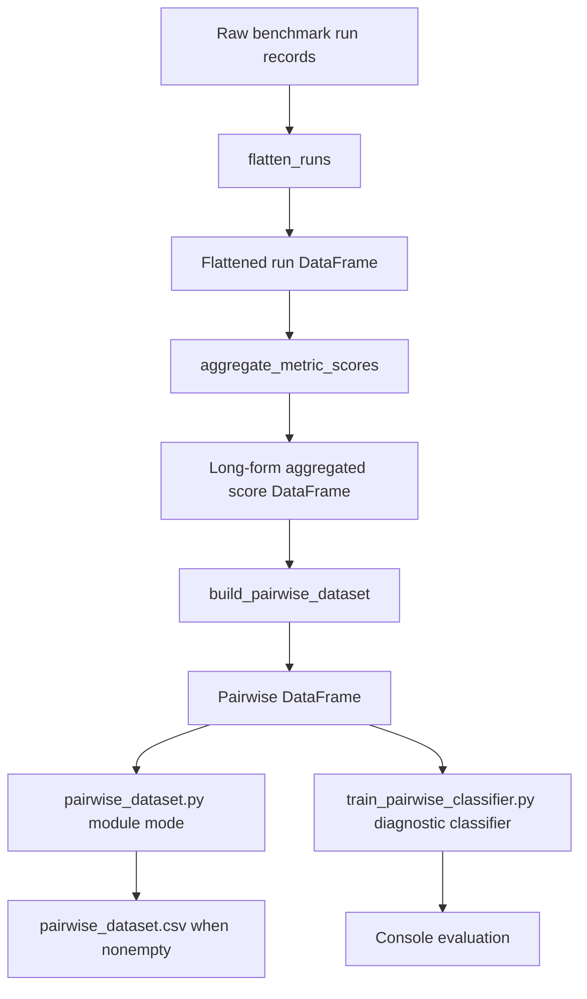

#PDL Sensitivity Analysis

## PDL Repository Status

**Partial. Repository implementation evidence.** `src/leaderboard/pdl/__init__.py` calls the PDL package a prototype. The repository includes `flatten_runs`, `aggregate_metric_scores`, `build_pairwise_dataset`, and the diagnostic script `train_pairwise_classifier.py`. The default metrics are `mse` and `spearman`.

**Partial. Repository implementation evidence.** Pair context and output columns are defined by `PAIR_CONTEXT_COLUMNS` and the dataset builder columns around lines 148 to 164. Labels are `1` when method A beats method B under `METRIC_SPECS[metric].higher_is_better`. Ties and nonfinite values are skipped.

**Partial. Repository implementation evidence.** `_split_pairwise` uses `GroupShuffleSplit` on `CONTEXT_COLUMNS` when there are at least two groups. The one-context fallback is explicitly diagnostic only.

**Proposed benchmark-specific design.** A production sensitivity analysis and reporting protocol is proposed here. The current builder and trainer are a prototype and diagnostic path, not a complete production PDL benchmark report.

## Pairwise Dataset Implementation

**Partial. Repository implementation evidence.** The current PDL path is a prototype that turns raw benchmark run records into aggregated score rows, then into pairwise comparison rows, then optionally into a diagnostic classifier. The representation step, descriptive analysis step, classifier step, and proposed sensitivity report are separate stages.



**Partial. Repository implementation evidence.** `pairwise_dataset.py` module mode writes `pairwise_dataset.csv` only when the pairwise DataFrame is nonempty. `train_pairwise_classifier.py` runs the same data preparation path for diagnostics, but it does not write CSV files, model files, or other artifacts.

### Input Benchmark Records

**Repository implementation evidence.** The standard run record source is `create_run_record` in `src/leaderboard/runner/record_builder.py`. The table below lists the raw fields consumed or retained by the PDL preparation path, plus columns generated later by flattening, aggregation, and pairing.

| Input field | Meaning | Used by | Why required |
| --- | --- | --- | --- |
| `game_name` | Raw source field returned by `create_run_record`; benchmark game name. | `flatten_runs`, `aggregate_metric_scores`, `build_pairwise_dataset`, diagnostic classifier. | Retained as benchmark context, aggregation and pair grouping key, and categorical classifier feature. |
| `game_id` | Raw source field returned by `create_run_record`; game identifier. | `flatten_runs`. | Retained in flattened output for traceability; it is not part of the current aggregation group, pair context, or classifier feature set. |
| `game_params` | Raw source field returned by `create_run_record`; game parameter mapping. | `flatten_runs`. | Retained as raw parameter provenance and converted into generated `game_params_json` for grouping and modeling. |
| `n_players` | Raw source field returned by `create_run_record`; player count. | `flatten_runs`, `aggregate_metric_scores`, `build_pairwise_dataset`, diagnostic classifier. | Required as benchmark context, aggregation and pair grouping key, and numeric classifier feature. |
| `approximator_name` | Raw source field returned by `create_run_record`; method name. | `flatten_runs`, `aggregate_metric_scores`, `build_pairwise_dataset`. | Required to aggregate by method and form generated `approximator_A` and `approximator_B` pair identities. |
| `approximator_params` | Raw source field returned by `create_run_record`; approximator parameter mapping. | `flatten_runs`. | Retained as raw method-configuration provenance and converted into generated `approximator_params_json`; it is not a current classifier feature. |
| `index` | Raw source field returned by `create_run_record`; interaction index. | `flatten_runs`, `aggregate_metric_scores`, `build_pairwise_dataset`, diagnostic classifier. | Required as benchmark context, aggregation and pair grouping key, and categorical classifier feature. |
| `max_order` | Raw source field returned by `create_run_record`; maximum interaction order. | `flatten_runs`, `aggregate_metric_scores`, `build_pairwise_dataset`, diagnostic classifier. | Required as benchmark context, aggregation and pair grouping key, and numeric classifier feature. |
| `budget` | Raw source field returned by `create_run_record`; approximation budget. | `flatten_runs`, `aggregate_metric_scores`, `build_pairwise_dataset`, diagnostic classifier. | Required as benchmark context, aggregation and pair grouping key, numeric classifier feature, and source for generated `log_budget`. |
| `approx_seed` | Raw source field returned by `create_run_record`; legacy `seed` is normalized to this column by `flatten_runs`. | `flatten_runs`, `aggregate_metric_scores`. | Retained for seed provenance; aggregation counts usable seed metric values through generated `n_seeds`. |
| `ground_truth_method` | Raw source field returned by `create_run_record`; ground-truth source. | `flatten_runs`, `aggregate_metric_scores`, `build_pairwise_dataset`, diagnostic classifier. | Required as benchmark context, aggregation and pair grouping key, and categorical classifier feature. |
| `runtime_seconds` | Raw source field returned by `create_run_record`; run duration. | `flatten_runs`. | Retained in flattened output for run provenance; it is not part of the current aggregation group, pair context, or classifier feature set. |
| `shapiq_version` | Raw source field returned by `create_run_record`; package version. | `flatten_runs`. | Retained in flattened output for reproducibility provenance; it is not part of the current aggregation group, pair context, or classifier feature set. |
| `hardware` | Raw source field returned by `create_run_record`; hardware metadata. | `flatten_runs`. | Retained in flattened output for run provenance; it is not part of the current aggregation group, pair context, or classifier feature set. |
| `run_failed` | Raw source field returned by `create_run_record`; failure flag. | `flatten_runs`. | Required for filtering only records where `run_failed is True`; other missing context is not independently validated here. |
| `metrics` | Raw source field returned by `create_run_record`; nested metric mapping. | `flatten_runs`, `aggregate_metric_scores`. | Required as the source of generated metric columns; missing, invalid, or non-dict values become `{}` before flattening. |
| `game_params_json` | Generated flattened column from raw `game_params`. | `flatten_runs`, `aggregate_metric_scores`, `build_pairwise_dataset`, diagnostic classifier. | Required as stable grouped context and categorical classifier feature. |
| `approximator_params_json` | Generated flattened column from raw `approximator_params`. | `flatten_runs`. | Retained for method-configuration traceability; it is not part of the current aggregation group, pair context, or classifier feature set. |
| Metric columns, for example `mse`, `spearman` | Generated flattened columns from raw `metrics` via `pd.json_normalize`. | `flatten_runs`, `aggregate_metric_scores`. | Required as numeric score inputs for selected metrics before aggregation into long-form score rows. |
| `metric` | Generated aggregation column naming the selected metric. | `aggregate_metric_scores`, `build_pairwise_dataset`, diagnostic classifier. | Required as pair context, categorical classifier feature, and selector for metric-direction label construction. |
| `score_mean` | Generated aggregation column containing the mean usable numeric score. | `aggregate_metric_scores`, `build_pairwise_dataset`. | Required as the value compared when constructing pair scores and labels; it is not a classifier feature. |
| `n_seeds` | Generated aggregation column counting non-null numeric seed values. | `aggregate_metric_scores`. | Required to audit how many usable seed metric values contributed to `score_mean`; it is not a pair output or classifier feature. |
| `log_budget` | Pair-generated column from positive finite raw `budget`; otherwise `NaN`. | `build_pairwise_dataset`, diagnostic classifier. | Required as a numeric classifier feature that represents budget on a log scale. |
| `approximator_A`, `approximator_B` | Pair-generated columns from lexicographically oriented `approximator_name` values. | `build_pairwise_dataset`, diagnostic classifier. | Required to identify the oriented method pair and serve as categorical classifier features. |
| `score_A`, `score_B` | Pair-generated columns from finite oriented `score_mean` values. | `build_pairwise_dataset`. | Required to construct the label and audit pair outcomes; these leakage-sensitive score fields are not classifier features. |
| `score_diff` | Pair-generated column computed as `score_A - score_B`. | `build_pairwise_dataset`. | Retained for audit and descriptive summaries; it is score-derived, leakage-sensitive, and not a classifier feature or independent label-construction input. |
| `label` | Pair-generated binary target. | `build_pairwise_dataset`, diagnostic classifier. | Required as the supervised target, with `1` meaning A beats B for the selected metric direction. |

**Repository implementation evidence.** Filtering is intentionally narrow. `flatten_runs` excludes only records where `run_failed is True`. Missing `RUN_COLUMNS` become `pd.NA`, and `flatten_runs` does not separately validate missing context fields. `aggregate_metric_scores` calls `pd.to_numeric(..., errors="coerce")`, then uses `mean` and `count`; missing, `None`, and non-numeric metric values become missing numeric values and don't contribute to mean or count. `build_pairwise_dataset` later skips scores that fail `_finite_float`: non-`int` or non-`float`, `bool`, `NaN`, and infinite values. It skips exact equality only.

### flatten_runs

**Repository implementation evidence.** `flatten_runs` converts `list[dict]` to `pandas.DataFrame`. Each retained raw run becomes one flattened row. Nested metrics become columns through `pd.json_normalize`; this step does not create one row per metric.

The normal returned columns are exactly `RUN_COLUMNS`, `game_params_json`, and `approximator_params_json`. `RUN_COLUMNS` are `game_name`, `game_id`, `game_params`, `n_players`, `approximator_name`, `approximator_params`, `index`, `max_order`, `budget`, `approx_seed`, `ground_truth_method`, `runtime_seconds`, `shapiq_version`, `hardware`, `mse`, and `spearman`. Other raw keys can remain because pandas is constructed from the raw records. Empty input returns exactly the declared return columns. This behavior is covered by `test_flatten_runs_normalizes_seed_and_flattens_metrics`.

Illustrative raw input:

```json
[
  {
    "game_name": "ExampleGame",
    "game_id": "example-1",
    "game_params": {"size": 4},
    "n_players": 4,
    "approximator_name": "MethodA",
    "approximator_params": {"alpha": 0.1},
    "index": "SII",
    "max_order": 2,
    "budget": 100,
    "seed": 7,
    "ground_truth_method": "exact",
    "runtime_seconds": 1.4,
    "shapiq_version": "0.1.0",
    "hardware": "cpu",
    "run_failed": false,
    "metrics": {"mse": 0.02, "spearman": 0.91}
  }
]
```

Result shape, shortened to the relevant columns:

| game_name | approx_seed | mse | spearman | game_params_json | approximator_params_json |
| --- | ---: | ---: | ---: | --- | --- |
| ExampleGame | 7 | 0.02 | 0.91 | `{"size":4}` | `{"alpha":0.1}` |

### aggregate_metric_scores

**Repository implementation evidence.** `aggregate_metric_scores` groups by the exact `SCORE_GROUP_COLUMNS`: `game_name`, `game_params_json`, `n_players`, `index`, `max_order`, `ground_truth_method`, `budget`, and `approximator_name`. The default metrics are `DEFAULT_METRICS = ("mse", "spearman")`. Only requested metric columns that are present are processed.

Each selected metric column is converted to long-form rows with `metric`, `score_mean`, and `n_seeds`. No standard deviation is retained. One output row represents one approximator and one selected metric under the fixed group context, averaged over usable seed metric values. If seed values are missing or non-numeric, `n_seeds` can be below the expected seed count or zero. A zero usable count can produce output that later fails finite-score pairing. This behavior is covered by `test_aggregate_metric_scores_averages_across_seeds`.

### build_pairwise_dataset

**Repository implementation evidence.** `build_pairwise_dataset` groups score rows by the exact `PAIR_CONTEXT_COLUMNS`: `game_name`, `game_params_json`, `n_players`, `index`, `max_order`, `ground_truth_method`, `budget`, and `metric`. Within each context, it iterates `itertools.combinations`, not permutations. It sorts `approximator_name` lexicographically, emits one orientation, and does not emit the reversed pair.

Metric direction comes from `METRIC_SPECS[metric].higher_is_better`. For lower-is-better metrics, A wins when `score_A < score_B`. For higher-is-better metrics, A wins when `score_A > score_B`. Exact ties are skipped. Nonfinite scores are skipped. `log_budget` is `log(budget)` only for finite positive budgets, otherwise `NaN`. Metrics outside the requested set raise clear validation errors. The intended pipeline has aggregation produce one row per approximator group, but the builder itself iterates row combinations from the input rows.

Precise pseudocode:

```text
for context, rows in aggregated_scores grouped by PAIR_CONTEXT_COLUMNS:
    validate metric is known and requested
    higher_is_better = METRIC_SPECS[metric].higher_is_better
    for left, right in itertools.combinations(rows, 2):
        orient rows by lexicographic approximator_name
        score_A = _finite_float(oriented A score_mean)
        score_B = _finite_float(oriented B score_mean)
        if either score is missing, bool, NaN, or infinite:
            continue
        if score_A == score_B:
            continue
        if higher_is_better:
            label = 1 if score_A > score_B else 0
        else:
            label = 1 if score_A < score_B else 0
        log_budget = log(budget) if budget is finite and positive else NaN
        emit one pair row
```

Direct tests include `test_mse_lower_score_wins`, `test_spearman_higher_score_wins`, `test_log_budget_is_created`, `test_pairs_are_only_created_within_same_game_params_context`, `test_ties_are_skipped`, `test_missing_scores_are_skipped`, and `test_metrics_outside_requested_set_raise_clear_error`.

### Meaning of One Pairwise Row

**Repository implementation evidence.** `build_pairwise_dataset` returns output columns exactly in this order: `game_name`, `game_params_json`, `n_players`, `index`, `max_order`, `ground_truth_method`, `budget`, `log_budget`, `metric`, `approximator_A`, `approximator_B`, `score_A`, `score_B`, `score_diff`, and `label`.

| Column | Model feature? | Label construction? | Notes |
| --- | --- | --- | --- |
| `game_name` | Yes, categorical | No | Classifier feature. |
| `game_params_json` | Yes, categorical | No | Classifier feature. |
| `n_players` | Yes, numeric | No | Classifier feature. |
| `index` | Yes, categorical | No | Classifier feature. |
| `max_order` | Yes, numeric | No | Classifier feature. |
| `ground_truth_method` | Yes, categorical | No | Classifier feature. |
| `budget` | Yes, numeric | No | Classifier feature. |
| `log_budget` | Yes, numeric | No | Classifier feature. |
| `metric` | Yes, categorical | Yes | Classifier feature; selects `METRIC_SPECS[metric].higher_is_better`, which determines comparison direction. |
| `approximator_A` | Yes, categorical | No | Classifier feature. |
| `approximator_B` | Yes, categorical | No | Classifier feature. |
| `score_A` | No | Yes | Leakage-sensitive score-derived field. |
| `score_B` | No | Yes | Leakage-sensitive score-derived field. |
| `score_diff` | No | No | Audit-only, derived as `score_A - score_B`; leakage-sensitive and not independently used to construct the label. |
| `label` | Target | Target | Binary target. |

### Worked Example

**Illustrative example, not repository results.** Suppose the lexicographic orientation is `approximator_A = "MethodA"` and `approximator_B = "MethodB"`. For `mse`, lower is better. If `score_A = 0.08` and `score_B = 0.12`, A wins and `label = 1`. For `spearman`, higher is better. If `score_A = 0.75` and `score_B = 0.82`, B wins and `label = 0`. The label always answers whether the oriented A method beats the oriented B method for that metric.

## Why the Pairwise Dataset Is Useful

**Proposed benchmark-specific design.** The pairwise representation changes the question from "what is each method's absolute score?" to "which method wins under this benchmark context, metric, budget, and interaction setting?" This can make metric scales easier to compare because labels are conditional wins rather than raw values.

**Proposed benchmark-specific design.** The dataset supports contextual method selection questions, such as whether a method tends to win at low budgets but lose at high budgets, or whether a method pair changes behavior across games or interaction orders. The pairwise dataset keeps a context-conditional comparison row.

**Proposed benchmark-specific design.** Limitations should be reported with the dataset. Pair rows are dependent because many rows share runs and contexts. Pair count grows quadratically with methods per context. Labels are metric-specific. The binary label loses margin magnitude, although `score_diff` can describe it. Models may learn method identity associations rather than causal effects. The dataset supports association analysis, not causal claims.

## What Can Be Observed Directly From the Dataset

**Proposed benchmark-specific design.** Useful descriptive analyses can be computed without classifier training: global pairwise win rates, win rates by metric, win rates by budget, win rates by game, and win rates by interaction order. Pairwise win matrices by method pair can summarize where one method wins more often than another.

**Proposed benchmark-specific design.** Stability across seeds should be treated as a proposed secondary analysis because the main implemented pipeline aggregates seed outcomes before pair creation and does not preserve per-seed labels. Margin of victory can be computed or summarized from implemented `score_diff`, but it is descriptive and score-derived, not a valid classifier feature.

**Proposed benchmark-specific design.** These descriptive analyses are not currently implemented report outputs. They are direct summaries that a future report can compute from the pairwise DataFrame.

## Diagnostic Pairwise Classifier

**Partial. Repository implementation evidence.** `train_pairwise_classifier.py` loads raw runs through `_load_raw_runs` from a local client. `DEFAULT_PATH` is `src/leaderboard/data/results_23Jun_1658.jsonl`. It then executes `flatten_runs`, `aggregate_metric_scores`, and `build_pairwise_dataset` in that order. It requires at least two pair rows and both labels before fitting.

**Partial. Repository implementation evidence.** The classifier constants are exact. `CATEGORICAL_FEATURES` are `game_name`, `game_params_json`, `index`, `ground_truth_method`, `metric`, `approximator_A`, and `approximator_B`. `NUMERIC_FEATURES` are `n_players`, `max_order`, `budget`, and `log_budget`. `CONTEXT_COLUMNS` are `game_name`, `game_params_json`, `n_players`, `index`, `max_order`, `ground_truth_method`, `budget`, and `metric`.

**Partial. Repository implementation evidence.** The preprocessing step is a `ColumnTransformer` with `OneHotEncoder(handle_unknown="ignore")` for categorical features and numeric passthrough for numeric features. The model pipeline uses `RandomForestClassifier(random_state=42, n_estimators=100)`.

**Partial. Repository implementation evidence.** `_split_pairwise` concatenates `CONTEXT_COLUMNS` to make groups and uses `GroupShuffleSplit(n_splits=1, test_size=0.25, random_state=42)` when there are at least two groups. Only when there is one group does it use diagnostic `train_test_split(test_size=0.25, random_state=42, stratify conditional)`. The script calls only `predict`, so it outputs class predictions, train and test sizes, accuracy, balanced accuracy, and `classification_report`. It does not currently calculate probabilities or export models or artifacts.

**Partial. Repository implementation evidence.** No dedicated classifier tests were found in `tests/leaderboard/test_pairwise_dataset.py`. The classifier should therefore be described as a diagnostic prototype, not a validated production training path.

## PDL Sensitivity Analysis Proposal

**Proposed benchmark-specific design.** The implemented builder is a representation step. Descriptive summaries are observed win rates and related direct counts. The diagnostic classifier reports associations and class predictions. Sensitivity analysis is a separate reporting protocol that systematically varies or groups dimensions and observes changes in winners, win rates, or model effects.

**Proposed benchmark-specific design.** Sensitivity dimensions can include budget, metric, game, `n_players`, `max_order`, `ground_truth_method`, and approximator pair. A report might say, as an illustrative interpretation pattern and not as an observed repository result, "Method A wins against Method B for `mse` at low budgets on this game family, but the win rate switches after a higher budget bin." Classifier output alone is not sensitivity analysis.

**Proposed benchmark-specific design.** A production sensitivity analysis should keep score-derived fields out of predictive features. `score_A`, `score_B`, and `score_diff` define or audit the target and are leakage-sensitive. They can be used for label construction, checks, and post-hoc descriptions only.

### Proposed Seed Handling

**Repository implementation evidence.** `aggregate_metric_scores` averages requested scores across approximation seeds grouped by `SCORE_GROUP_COLUMNS`, emitting `score_mean` and `n_seeds`. `build_pairwise_dataset` does not implement exact-seed pairing.

**Proposed benchmark-specific design.** Two seed policies should be documented before analysis. Pairing runs that share `approx_seed` preserves paired seed variability, but it requires matched seeds and can discard unmatched runs. Aggregating each method's seeds before pair building reduces seed noise and produces one context-level label, but it hides per-seed variation.

**Proposed benchmark-specific design.** The recommended main benchmark rule is to aggregate each method's seeds before pair building, matching the implemented `aggregate_metric_scores` seed mean and `n_seeds` behavior. Exact-seed pairing should only be used as a separately reported diagnostic if it is implemented and documented later.

### Proposed Tie Policy

**Partial. Repository implementation evidence.** `build_pairwise_dataset` currently skips ties only when `score_a == score_b`; it also skips nonfinite scores. No PDL numerical tolerance is implemented.

**Proposed benchmark-specific design.** A production PDL analysis should choose and document a metric-specific numerical tolerance before analysis. If `abs(score_a - score_b) <= tolerance`, the pair should be labeled as a tie, excluded, or reported separately according to that documented rule. This proposed PDL tolerance is not implemented by the current pairwise dataset builder.

### Proposed Symmetry and Positional Bias Checks

**Partial. Repository implementation evidence.** `build_pairwise_dataset` lexicographically sorts `approximator_name`, producing one A/B orientation. It does not generate reversed pairs by default.

**Proposed benchmark-specific design.** The benchmark report should test both orientations as a positional-bias check and include an antisymmetry diagnostic: `p(A beats B | context) ~= 1 - p(B beats A | context)`. The report should define a documented tolerance or summary statistic for deviations before evaluation. Any reversed-pair experiment is proposed behavior, not current dataset-builder behavior.

**Literature evidence.** Wetzel, Melko, and Tamblyn define a twin neural network regression setup with a difference target in Section 3.1, Eq. (1), use anchor prediction and reversal in Eq. (2), and discuss loop consistency and dependence in Section 3.2, Eq. (3) [PDL-Regression]. Belaid, Rabus, and Hullermeier discuss pair datasets and representations, including concatenation plus difference, symmetry and reversal, unseen query anchoring and posterior prediction, and dependence, cross-validation, and limitations [PDL-Classification].

**Citation integrity note. Literature evidence.** TabPFN Section 2 and Eq. 1 to 4 describe prior-data fitted networks for small tabular classification, not PDL. TabPFN is a possible future classifier candidate for a small tabular pairwise dataset, not the source of the PDL transformation. Any TabPFN use here is an explicit proposed classifier experiment, not implemented behavior [TabPFN].

**Literature evidence gap.** No cited PDL publication here is evidence that PDL evaluates Shapley interaction approximators. The proposed analysis should be framed as benchmark-specific sensitivity analysis, not as a validated Shapley approximation evaluation method.

## PDL, Pairwise Classification, and Preference Learning

**Proposed benchmark-specific design with literature boundaries.** In this benchmark, PDL means a conditional prediction setup built from benchmark context and pair representation, then used for the sensitivity-analysis questions above. Ordinary pairwise classification is the broader machine-learning form: a model predicts a binary label for pairs. Preference learning is another broader framing for comparisons or preferences. Global ranking estimates a ranking or rating over methods rather than a context-conditional pair outcome. The cited PDL sources substantiate pair construction, pair representations, reversal or symmetry considerations, anchoring, and dependence, cross-validation, and limitations, but they do not establish a universal boundary that makes PDL categorically separate from all pairwise classification or preference learning [PDL-Regression] [PDL-Classification].

**Proposed benchmark-specific design.** PDL sensitivity analysis asks whether pairwise outcomes are predictable from benchmark context and pair representation, whether observed wins are stable across grouped dimensions, and whether conclusions are stable under leakage-safe grouping.

## Relation to the Existing Elo Scorer

The Elo scorer is an existing repository component, not part of this contribution. Elo produces a global rating from observed pairwise outcomes. PDL models and analyzes context-dependent pairwise outcomes. Elo asks, `Who performs best overall?` PDL sensitivity asks, `Under which conditions does A outperform B?` PDL does not replace Elo.

## Grouped Leakage-Safe Evaluation

**Partial. Repository implementation evidence.** `_split_pairwise` uses `GroupShuffleSplit` on `CONTEXT_COLUMNS` when at least two groups exist. This keeps all pairs from the same complete benchmark context together. The one-context fallback is diagnostic only and should not be presented as production validation.

**Proposed benchmark-specific design.** Grouped evaluation is a validation policy for the classifier, not sensitivity analysis by itself. It prevents the same context from leaking into train and test through different pair rows. Because pairs share runs and contexts, pair rows are dependent rather than independent and identically distributed. Reported uncertainty should respect this dependence.

**Proposed benchmark-specific design.** Sensitivity reporting can use the same grouping ideas, but it asks a different question: how observed winners, win rates, or feature effects change across budget, metric, game, `n_players`, `max_order`, `ground_truth_method`, and approximator pair.

**Proposed benchmark-specific design.** The proposed evaluation protocols are:

| Protocol | Question asked |
| --- | --- |
| Complete-context split | Interpolation to unseen comparisons within known broader domains. |
| Game split | Generalization to unseen game instances within represented game families. |
| Dataset split | Transfer to held-out underlying datasets. This requires a proposed dataset grouping or mapping because the current PDL schema has no explicit dataset column. |
| Leave-one-game-out | Transfer to a wholly held-out game. |

**Proposed benchmark-specific design.** A benchmark report should state the grouping columns, number of groups, train and test group counts, skipped ties, skipped nonfinite comparisons, and whether pair reversal was used. It should also report results separately by metric because `higher_is_better` changes label direction.

## Concrete Outputs for a Future Sensitivity Report

**Proposed benchmark-specific design.** A future sensitivity report should include the following outputs, with no invented values:

1. Original raw run record count.
2. Flattened retained run row count.
3. Aggregated score row count.
4. Pairwise row count.
5. Skipped tie count.
6. Skipped nonfinite score count.
7. Pairwise class distribution.
8. Unique complete-context count.
9. Unique approximator-pair count.
10. Global pairwise win matrix.
11. Win rates by metric.
12. Win rates by budget or budget bin.
13. Win rates by game, `n_players`, `max_order`, and `ground_truth_method`.
14. Winner-switch summaries across budget, metric, game, or interaction order.
15. Grouped classifier performance and feature-effect summaries, when a classifier is used.
16. Brief global-leaderboard comparison reference, when useful.

## PDL Implementation Traceability

| Step | Function or path | Evidence and status |
| --- | --- | --- |
| Flatten raw runs | `flatten_runs` in `src/leaderboard/pdl/pairwise_dataset.py` | `test_flatten_runs_normalizes_seed_and_flattens_metrics`; implemented prototype behavior. |
| Aggregate scores | `aggregate_metric_scores` in `src/leaderboard/pdl/pairwise_dataset.py` | `test_aggregate_metric_scores_averages_across_seeds`; implemented prototype behavior. |
| Generate pairs | `build_pairwise_dataset` in `src/leaderboard/pdl/pairwise_dataset.py` | `test_mse_lower_score_wins`, `test_spearman_higher_score_wins`, `test_pairs_are_only_created_within_same_game_params_context`, and related pairwise tests; implemented prototype behavior. |
| Direction labels | `METRIC_SPECS[metric].higher_is_better` used by `build_pairwise_dataset` | `test_mse_lower_score_wins` and `test_spearman_higher_score_wins`; implemented prototype behavior. |
| Skip ties | `build_pairwise_dataset` exact equality skip | `test_ties_are_skipped`; implemented prototype behavior. |
| Group split | `_split_pairwise` in `src/leaderboard/pdl/train_pairwise_classifier.py` | Diagnostic prototype; no direct PDL test in `tests/leaderboard/test_pairwise_dataset.py`. |
| Train classifier | `src/leaderboard/pdl/train_pairwise_classifier.py` | Diagnostic prototype; no dedicated classifier test in `tests/leaderboard/test_pairwise_dataset.py`. |
| Report outputs | Future sensitivity report described in this page | Proposed; no implementation test. |

## Implementation Status Summary

| Component | Status | Contribution |
| --- | --- | --- |
| Individual metrics | Implemented | Part of this work |
| Metric scorer | Implemented | Part of this work |
| Pairwise dataset builder | Prototype | Part of this work |
| Diagnostic classifier | Prototype | Part of this work |
| Sensitivity reporting | Proposed | Proposed in this work |
| Elo scorer | Existing | Not part of this contribution |

* [TabPFN] Noah Hollmann, Samuel Muller, Katharina Eggensperger, Frank Hutter. “TabPFN: A Transformer That Solves Small Tabular Classification Problems in a Second.” ICLR 2023. arXiv:2207.01848. DOI 10.48550/arXiv.2207.01848.
* [PDL-Regression] Sebastian J. Wetzel, Roger G. Melko, Isaac Tamblyn. “Twin neural network regression is a semi-supervised regression algorithm.” Machine Learning: Science and Technology 3(4), 045007 (2022). DOI 10.1088/2632-2153/ac9885.
* [PDL-Classification] Mohamed Karim Belaid, Maximilian Rabus, Eyke Hullermeier. “Pairwise Difference Learning for Classification.” arXiv:2406.20031 (2024). arXiv DOI 10.48550/arXiv.2406.20031.
